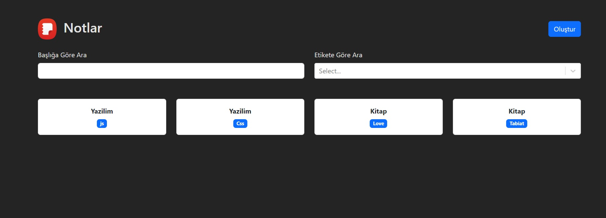
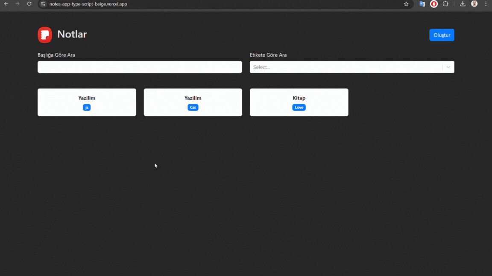

# TypeScript_Notes_App

CoinMania is a cryptocurrency tracking web application built using React, Redux, and the CoinCap API 2.0, following the Model-View-Controller (MVC) principle. It allows users to monitor real-time prices, market capitalizations, and other metrics of various cryptocurrencies. Users can also access historical price data and analyze trends over time.

# Tools and Libraries Used

- React**: ^18.3.1
- TypeScript**
- @uidotdev/usehooks**: ^2.4.1
- Bootstrap**: ^5.3.3
- React Bootstrap**: ^2.10.4
- React DOM**: ^18.3.1
- React Markdown**: ^9.0.1
- React Router DOM**: ^6.25.1
- React Select**: ^5.8.0
- UUID**: ^10.0.0

# Screenshots

## Gif

# For Live Project

https://notes-app-type-script-beige.vercel.app/
